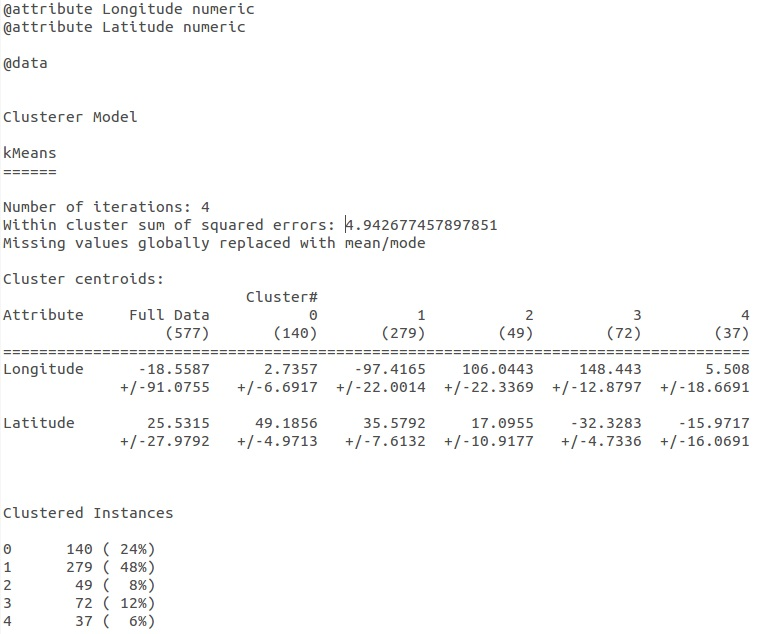

FlickrClusterization
==============
#1. O projektu
Tema projekta je da se kreira aplikacija koja će omogućiti da se pristupi podacima o slikama korišćenjem Flickr API-a (https://www.flickr.com/services/api/). Potrebno je preuzeti podatke o slikama, zatim obraditi podatke i sačuvati ih, kasnije pomoću servisa Geonames (http://www.geonames.org/) preuzeti podatke o lokaciji, odnosno državi.
Takođe, potrebno je klasterizovati preuzete slike.

Faze u razvoju aplikacije:
* Preuzimanje podataka o slikama kroz Flickr API i njihovo čuvanje
* Obrada podataka (biranje podataka koji sadrže podatak o lokaciji)
* Dobijanje i čuvanje podataka o lokaciji
* Klasterizacija podataka

#2. Domenski model
Nakon analize podataka koje pruža Flickr API (https://www.flickr.com/services/api/), kreiran je domenski model koji je prikazan na slici ispod (Slika 1).


Slika 1 - Domenski model

Klasa Photo sadrži podatke o slici kao što su: id, id vlasnika, naslov slike, server, secret kod i podatak o lokaciji koji se dobija korišćenjem Geonames servisa. 

#3. Rešenje
Aplikacija preuzima podatke sa dva različita izvora ([Flickr](https://www.flickr.com/services/api/), [Geonames](http://www.geonames.org/)), zatim spaja te podatke i stavlja ih u JSON fajl. 

[Flickr](https://www.flickr.com/services/api/) daje podatke o slici u željenom formatu. U sledećem primeru poziva korišćen je JSON format:
>[https://api.flickr.com/services/rest/?method=flickr.photos.search&text=shark&sort=relevance&page=1&api_key=64a298d057676a6d7298262797a23440&format=json]
(https://api.flickr.com/services/rest/?method=flickr.photos.search&text=shark&sort=relevance&page=1&api_key=64a298d057676a6d7298262797a23440&format=json)

Parametar *method* ukazuje na metodu koja se poziva na sajtu, u ovom slu;aju je to metoda search. Da bi se koristila metoda search, potrebno je uneti kriterijum pretrage, što je u primeru zadata reč shark. Parametar *sort* se odnosi na način sortiranja, ovde je to po relevantnosti. Zatim, parametar *page* nam pomaže da se lakše kećemo po dobijenim rezultatima pretrage, odnosno da nam kao rezultat metode bude vraćena samo prva stranica. Parametar *api_key* se dobija prilikom registracije za korišćenje Flickr API-a, i obavezan je deo poziva svake metode. Parametar *format* nam omogućava da rezultat metode bude vraćen u formatu koji nama odgovara, u ovom slučaju je to JSON. Podaci koji se na osnovu ovog poziva preuzimaju su: id, userId, title, server, secret i location.

[Geonames](http://www.geonames.org/) daje podatke o geografskoj lokaciji unetog mesta. Ovde se mogu dobiti informacije kao što su geografska dužina i širina, kod države, populacija, naziv države. U sledećem primeru dat je poziv ovog servisa:

>[http://api.geonames.org/searchJSON?q=Lake%20Worth,%20FL,%20USA&maxRows=1&username=jelena_tabas](http://api.geonames.org/searchJSON?q=Lake%20Worth,%20FL,%20USA&maxRows=1&username=jelena_tabas)

Parametar *q* se odnosi na kriterijum pretrage, odnosno tu stoji informacija koje mesto želimo da nađemo, u ovom slučaju to je Lake Worth, FL, USA. Parametar *max_rows* nam omogućava da ograničimo rezultate pretrage, odnosno da dobijemo samo jedan rezultat, ovde je to prvi, koji smatramo najtačnijim, odnosno preciznijim za našu pretragu. Parametar *username* je potreban kako bi se izvršilo pozivanje Geonames servisa, dobija se prilikom registracije za korišćenje servisa. Preuzeti podaci: countryName.

Nakon preuzimanja podataka, može se primetiti da za pojedine slike ne postoji podatak o lokaciji, te nije mogao da se izvrši poziv servisa [Geonames](http://www.geonames.org/), odnosno nisu dobijeni podaci. Zbog toga su slike koje nemaju podatak o lokaciji izbačene iz obrade, tačnije, one koje imaju podatak o lokaciji su premeštene u drugi fajl.

Takođe, kako bi se kasnije omogućila klasterizacija slika na osnovu vrste ajkule koja je prikazana, bilo je potrebno izvršiti obradu podataka. Zbog toga se iz naslova slika zaključivalo koja je vrsta ajkule na slici, te se sama slika nazivala po vrsti. Rezultat ove operacije je dobijeno dvadeset i jedna vrsta ajkule i jedna kao nedefinisana koja ima naziv ajkula.

Svi podaci koji su dobijeni smeštani su u JSON fajl. Primer JSON objekta dat je niže:

```
	[
	  {
	    "id": "5266243108",
	    "userId": "21915962@N02",
	    "secret": "8bb6ebc8b8",
	    "server": "5284",
	    "title": "Reef",
	    "location": "Australia"
	  },
	  {
	    "id": "1038089969",
	    "userId": "94802649@N00",
	    "secret": "e01b5dd141",
	    "server": "1012",
	    "title": "Tiger",
	    "location": "Lake Worth, FL, USA"
	  }
	]
```

Kao što se može videti, JSON fajl se sastoji od JSON objekata. Svaki objekat sadrži podatke o slici: id, userId, secret, server, title i location. Dalje su ovi podaci konvertovani u ARFF fajl. ARFF (Attribute-Relation File Format) fajl je tekstualan ASCII koji opisuje listu instanci koje dele set atributa. ARFF fajl se kasnije koristi za klasterizaciju. Za klasterizaciju je izabrano četiri klastera, jer je probom ustanovljeno da se oko te vrednosti dešava najmanje rasipanje podataka, odnosno najmanja promena greške nastale usled klasterovanja.


#4. Korišćena tehnologija

Aplikacija je napisana u programskom jeziku Java. 

Prilikom realizacije aplikacije korišćene su sledeće tehnologije:

1. [Biblioteka za izvrsenje HTTP poziva](http://hc.apache.org/httpcomponents-client-ga/) - za izvršavanje poziva Flickr i Geonames metoda, kako bi se omogućilo dobijanje podataka na kojima će se kasnije raditi.

```
    	setMethod(new GetMethod(getRequest()));
	setStatusCode(getClient().executeMethod(getMethod()));
	if (getStatusCode() != HttpStatus.SC_OK) {
	   System.err.println("Method failed: " + getMethod().getStatusLine());
	}
	setRstream(null);
	setRstream(getMethod().getResponseBodyAsStream());
```

2. [Biblioteka za rad sa JSON-om](http://json.org/java/) - za korišćenje JSON formata i objekata. JSON omogućava lakšu manipulaciu podacima, s obzirom da su podaci smešteni u stablo. Identifikator podatka je njegov naziv preko koga mu se i pristupa. JSON fajl je i čitljiv, odnosno može se jasno razumeti, i ima jednostavnu formu.

```
      JSONObject jobj = new JSONObject(jstr);
      JSONObject owner = jobj.getJSONObject("photo").getJSONObject("owner");
```

3. [GSON biblioteka](https://code.google.com/p/google-gson/) - omogućava korišćenje JSON-a tako što konvertuje Java objekte u JSON objekte. Takođe, može se koristiti i obrnuto za pretvaranje JSON stringa u Java objekte.

```
	JsonArray photosArray = new JsonArray();
	JsonObject photoJson = new JsonObject();
	photoJson.addProperty("id", p.getId());
```

4. [Weka](http://weka.wikispaces.com/Use+WEKA+in+your+Java+code) - (Waikato Environment for Knowledge Analysis) - softver za mašinsko učenje koji omogućuje da izvršimo klasterizaciju podataka (slika). Weka čita iz ARFF fajla podatke, i na osnovu zadatih parametara (filtera, broja klastera, načina klasterizacije) vrši klasterizaciju i ispisuje rezultat.

```
	ClusterEvaluation eval = new ClusterEvaluation();
	eval.setClusterer(filteredClusterer);
	eval.evaluateClusterer(data);
```

U ovom primeru korišćen je SimpleKMeans algoritam za klasterovanje. Jedan je od najpoznatijih algoritama za klasterovanje. Koristi se tako što mu se zada broj klastera, a zatim on prolazeći kroz iteracije razvrstava podatke. SimpleKMeans grupiše instance na osnovu Euklidske udaljenosti u ravni koja je postavljena atributima tih instanci. Na početku, prilikom inicijalizacije nasumično bira onoliki broj težišta klastera koliko je zadati broj klastera. U sledećoj iteraciji razvrstava instance na osnovu udaljenosti od težišta klastera. Zatim pomera težište klastera na osnovu izračunatih proseka vrednosti instanci u klasteru. Ovaj postupak se ponavlja sve dok algoritam ne konvergira, jer daljim razvrstavanjem se nece dobiti značajnije promene, pa se proces zaustavlja. Primenom ovog algoritma, dobijeni su sledeći klasteri:



Kao što se na slici 2 može videti, dobijena su četiri klastera sa po 95, 282, 150 i 48 instanci respektivno. U prvom klasteru se nalaze vrste ajkula među kojima je najvise nurse ajkula. U drugom su pretežno bele ajkule. U trećem limun, tigar i reef ajkule. U četvrtom najviše ima kit ajkula.


U prvom se nalaze instance čija je lokacija najbliža Australiji (njih 95). U drugom se nalaze one koje su najbliže Sjedinjenim Američkim Državama (njih 282). U trećem se nalaze one koje su po lokaciji najbliže Francuskoj njih 150). U četvrtom se nalaze one instance koje su po lokaciji najbliže Kini (njih 48).

Na slici 3 se može videti koliko instanci je u kom klasteru. Od ukupno 575 instanci 95 (17%) je u prvom klasteru; 282 (49%) u drugom; 150 (26%) u trećem i 48 (5%) u četvrtom. Metodom probanja dobijeno je da se se prilikom klasterizacije na četiri klastera dobija najmanje osipanje podataka uz najmanju kvadratnu grešku od 7.061393049561895.


#5. Priznanja
Ova aplikacija je nastala kao rezultat seminarskog rada iz predmeta [Inteligentni sistemi](http://is.fon.rs/) na Fakultetu organizacionih nauka, Univerziteta u Beogradu, Srbija, 2014. godine.
